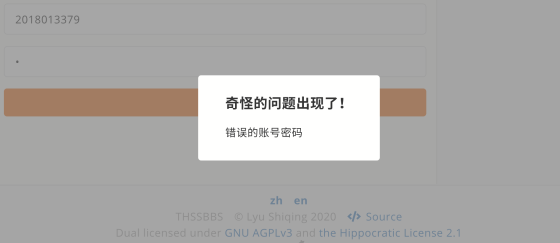
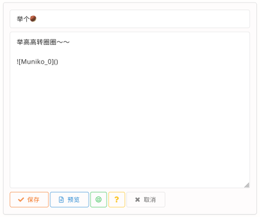
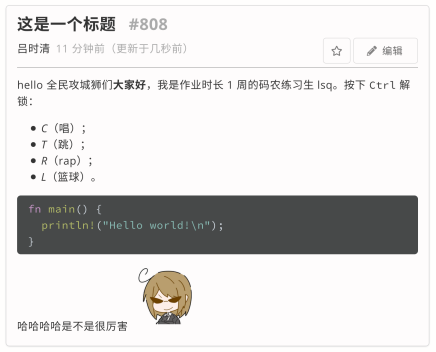
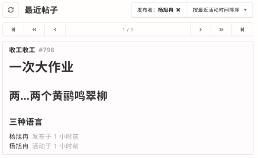
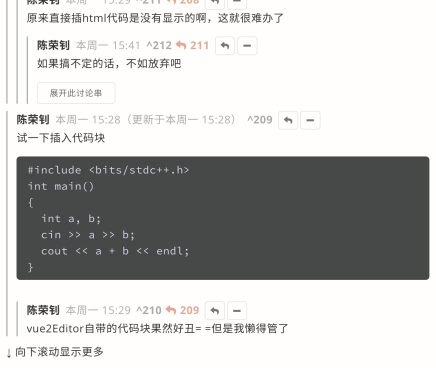
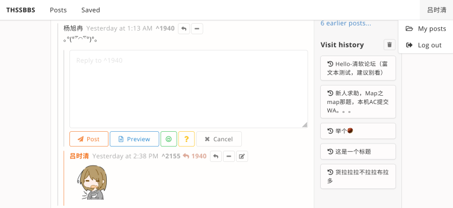

# THSSBBS

「清软论坛」前端实现。

代码仓库：[GitHub](https://github.com/kawa-yoiko/THSSBBS)

后端：http://simplebbs.iterator-traits.com/api，提供了 BBS 相关的基本 API，这是一个对应作业要求的前端实现。

## 环境搭建

安装最新版本的 Node 和 NPM（在 Node v14.5.0，NPM v6.14.5 下测试正常，NPM v6.9 以下会产生问题），进入仓库目录后执行

```
npm install
npm run serve
```

即可在 `localhost:8080` 启动项目。若要生成发布的版本，执行

```
npm run build
```

之后可在 `dist/` 目录下生成部署所需的文件。若使用 NGINX，可参考配置文件 `nginx.conf`。

在 https://quq.kawa.moe/ 部署了一份相同的版本，至少保持上线至 2020.9.6。

已在 Firefox 81, Chrome 85, Safari 13.1.2 中测试正常。

## 功能实现情况

**tl;dr** 全部实现，测试帖子 ID：808（http://localhost:8080/post/808）

- [x] 使用 Vue 或 React 等现代前端 Web 框架脚手架（推荐使用 Vue）如 `vue-cli` 或 `create-react-app` 实现一个论坛前端⻚面，可以正确与助教提供的后端进行交互（推荐使用 axios）。合理处理并提示用户后台返回的错误信息；
  - vue 3.0.0-rc.6
  - @vue/cli 4.5.4
- [x] 用户可以进行登录登出，应设计相应⻚面跳转与提示，在关闭浏览器后仍能保留登录状态；
  - 输入错误密码时，显示提示框
  - 
  - 登录超时时，自动引导至登录页面（无截图，可在新标签页中退出登录，然后在原标签页中进行任意需要登录的操作以测试）
- [x] 用户可以浏览帖子列表（应正确显示标题、发帖人、发帖时间等信息，合理处理分⻚），并且可以主动发帖/回帖或编辑自己发布的帖子与回帖；
  - 
  - 
  - 
- [x] 用户可以查看帖子详情以及相应的回帖，正确处理详情中的自定义格式，可以查看指定用户的发帖记录
  - 富文本采用 Markdown 格式实现，发帖与回帖均支持，编辑时均支持预览
  - 
  - 设置了 Markdown 语法速查表（点击编辑框下方的黄色问号按钮显示）
- [x] 可以正确显示不同用户的发帖记录，并实现合理的跳转；
  - 全站点击用户名时会引导至用户的发帖记录页面
  - 
- [x] ⻚面应美观大方，符合现代主流网⻚审美，用户体验良好
- [x] 实现 BBS 中楼中楼的显示来区分回复主楼与回复某一楼层，并合理实现回帖列表的前端分⻚；
  - 实现了类似 Reddit 的无限嵌套讨论串，设计了合理的展开方式
  - 
- [x] 自定义标签来实现表情与代码段的插入；
  - 支持一组 40 张图片的表情包，点击编辑框下方的绿色笑脸按钮即可插入
  - 
- [x] 实现外部图片链接的插入与合理展示（如⻓图）；
  - 与 GitHub 及部分论坛相同，推荐在外部图床上传完毕后直接粘贴 Markdown
  - 对于 Markdown 插入的图片，若高度过长则会自动限制高度并显示滚动条
- [x] 实现“只看楼主”、“收藏”、“浏览记录”功能；
  - 楼主与自己的回复分别用加粗边线与特殊颜色区分
  - “只看楼主”（以及“只看自己”）按钮位置见下图
  - 
  - 页面上右侧边栏可见“收藏夹”与“浏览记录”
- [x] 其他可以前端实现的亮点
  - 实现了多国语言支持，并保持本地设置
  - 语言设置按钮在页面底部
  - 

## 其他难点

目前 Vue 3 处于 RC 阶段，资料不如 Vue 2 那么多，市面上流行的不少库暂未适配（Ant Design 组件库在大作业开始后数天发布了适配 Vue 3 的 2.0.0 测试版 orz）；Composition API 与 Vue 2 API 的区别使得不少细节问题的解决方案不够成熟（如与原有 Mixin 对接不顺，又需避免 provide/inject 机制滥用，使得国际化等功能不得不在每个组件增加少量代码 —— 当然也有可能存在好的解决方案，只是我暂未发现）。另外，vue-router-next 也同样存在一些小坑（见后文）。这些问题都降低了一定开发效率，但是 Composition API 流畅的逻辑又确实提升了开发体验与可维护性，可谓是不破不立，期待 Vue 3 在未来发展得更好。

目前的版本仍有一些已知问题：
- 在 async 组件加载完成之前切换页面会导致后续所有渲染失败。控制台信息表示有可能是 Vue 内部 bug，触发规律相当明确且稳定，且暂未在项目的业务逻辑中发现问题，也并未进行规避处理，因该问题出现情况少且很有可能随着 Vue 的更新修复，影响不可观。
- vue-router-next 的 **replace()** 方法在保持 **fullPath** 不变而 **query** 变化时，部署到生产环境上会产生不明错误（在 Firefox 中提示原因不明的 `NS_ERROR_NOT_IMPLEMENTED`，在 Chrome/Safari 中是与 CSS 相关的错误），但在调试环境下没有此问题。目前已通过直接调用 HTML5 History API 的方式规避之，计划后续跟进此错误并在合适的情况下向 vue-router-next 发送 issue（也有可能是修复自己逻辑的 bug，捂脸）。

## 使用的库与组件

- Vue, Vue Router
- Semantic UI（仅样式部分）
- Marked
- highlight.js
- Moment.js
